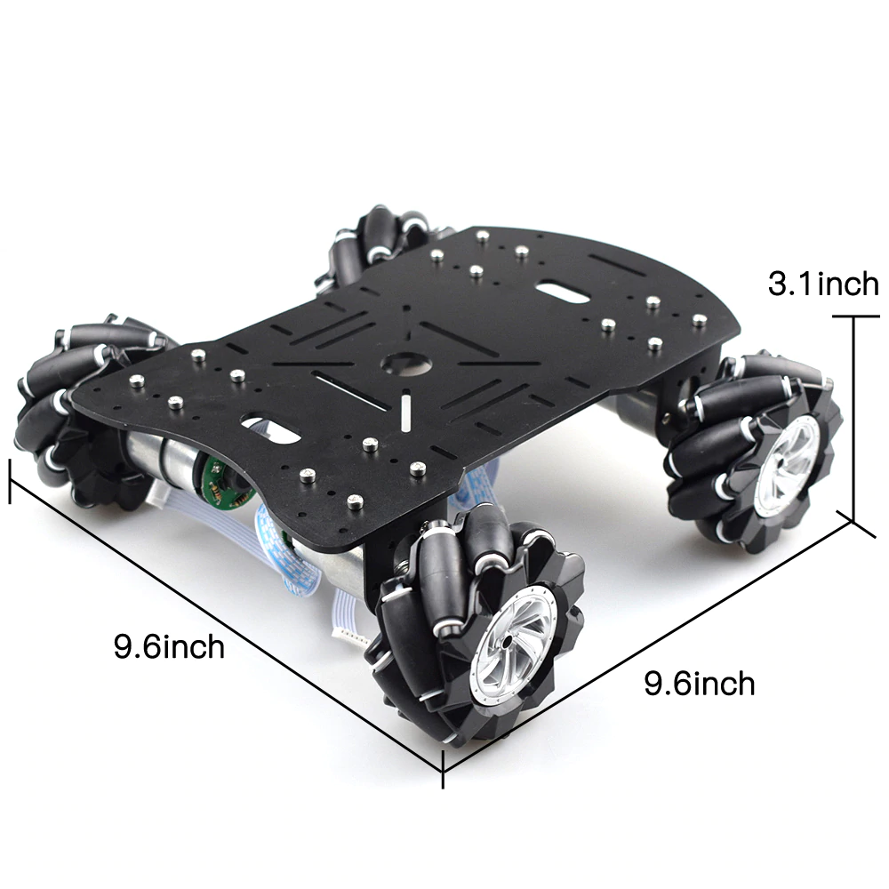

# Veículo de Tele-Presença

Este veículo de tele presença tem como objetivo de possibilitar uma pessoa se locomover e interagir virtualmente com outro ambiente via áudio e vídeo. O veículo utiliza o próprio navegador nativo da Raspbian para acessar um servidor de vídeo conferência público ou privado.

Este veículo necessita de acesso a uma rede WiFi para acessar o servidor de vídeo conferência e receber os comandos para se locomover, funciona a bateria de 12V 7Ah.

## Materiais necessários:

- 1 - Display 7" 1024x600 touch
- 1 - Raspberry PI 4 B
- 1 - WebCam Logitech C920
- 1 - Caixa de som
- 1 - Conjunto de rodas Mecanum, comprado na China já com arduino e placa de controle que recebe via serial os comandos de movimentos.
- 1 - Bateria 12V 7Ah chumbo ácido
- 1 - Adaptador USB TP-Link WiFi com antena de 4dB, não foi utilizado o WiFi da própria Raspberry em função do baixo ganho de recepção.
- 1 - Carregador de baterias
- 1 - Conversor DC-DC
- 1 - Cartão Micro-SD 8GB Classe 10
- 1 - Teclado sem fio
- 1 - Joystick PS2 




## Passos para instalação:

Utilizado imagem - (2020-02-13-raspbian-buster) e gravar em um Micro-SD

Utizado um Adaptador USB WiFi com antena externa de 4dB, aumentado o ganho com relação a On-bord da Raspberry PI 4 B qual foi desativada e configurarada a externa como a seguir:

```
sudo vi /boot/config.txt
dtoverlay=pi3-disable-wifi

sudo vi /etc/modprobe.d/raspi-blacklist.conf
#wifi
blacklist brcmfmac
blacklist brcmutil

sudo vi interfaces
source-directory /etc/network/interfaces.d
auto lo
iface lo inet loopback
iface eth0 inet manual
allow-hotplug wlan0
iface wlan0 inet manual
        wpa-conf /etc/wpa_supplicant/wpa_supplicant.conf

sudo raspi-config
Opção 5 - Interfacing Options / P2 SSH - Enable / P5 I2C - Enable / P6 Serial - Disable Shell and Enable Serial
```

## Atualize o Raspbian
```
sudo apt-get update
sudo apt-get upgrade
```

## telecontrol.py

Esta aplicação é pra ser executada na máquina que irá controlar o Veículo de tele-presença, ela pode receber comandos do mouse clicando diretamente na tela da aplicação ou usando um controle PS2, como da foto acima, e envia para o Veículo.


## teleserver.py

Este já roda diretamente na Raspberry como serviço, primeiramente coloque o teleserver.py no /home/pi e veja procedimento abaixo para coloca-lo como serviço:

```
cd /etc/systemd/system
$sudo vi teleserver.service
[Unit]
Description=Recebe comandos UDP do client telecontrol.py
After=multi-user.target

[Service]
Type=simple
ExecStart=/usr/bin/python /home/pi/teleserver.py
Restart=always
# Linha abaixo determina 5 segundos para o serviço reiniciar novamente caso ele seja interrompido.
RestartSec=5s

[Install]
WantedBy=multi-user.target

$sudo chmod ugo+x teleserver.service
$sudo systemctl daemon-reload
$sudo systemctl enable teleserver.service
$sudo systemctl start teleserver
$sudo systemctl status teleserver
```


## Continue...


